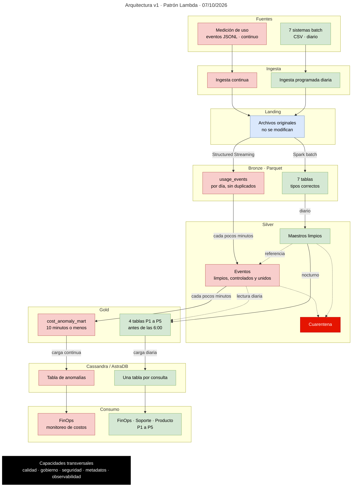

# Arquitectura v1 · Patrón Lambda · 07/10/2026

## Vista general

En rojo, el camino streaming; en verde, el camino batch. Los dos caminos se encuentran en Silver, donde cada evento se une con los maestros limpios (flecha "referencia").

## Vista detallada

Diagrama completo con las tablas de cada zona, sus particiones y sus reglas. Hacer clic en la imagen para verla en tamaño completo.

