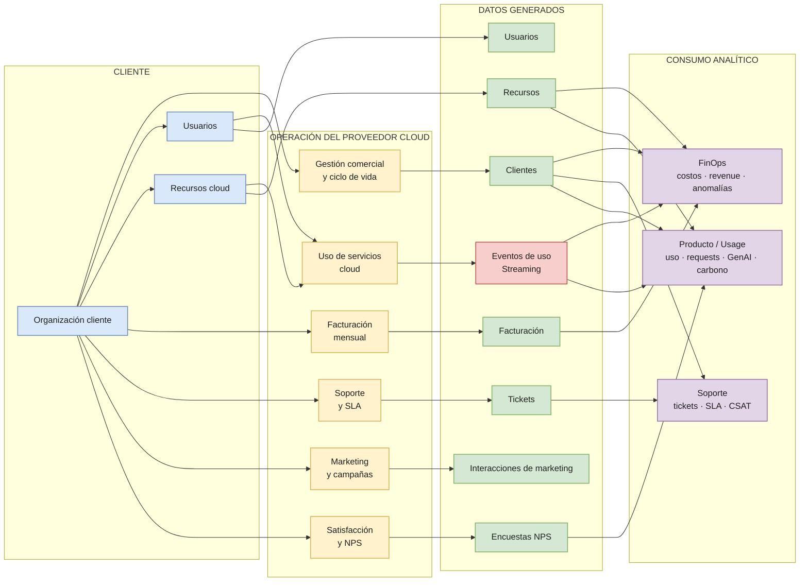

# Diagrama de Negocio — Cloud Provider Analytics

> Vista simplificada del negocio y de los principales flujos de información.  
> El objetivo es mostrar **qué ocurre en el negocio, qué datos genera y quién los utiliza**, sin mezclar todavía detalles de Landing, Bronze, Silver, Gold o Cassandra.

## Lectura del diagrama

El modelo se resume en cuatro bloques:

1. **Cliente:** la organización contrata recursos cloud y dispone de usuarios que los utilizan.
2. **Operación:** el proveedor gestiona clientes, registra el uso de los servicios, factura, atiende tickets y ejecuta acciones de marketing y satisfacción.
3. **Datos generados:** cada proceso produce una fuente analítica. Los eventos de uso son el único flujo continuo; el resto corresponde principalmente a información batch.
4. **Consumo analítico:** los datos se utilizan principalmente por **FinOps**, **Soporte** y **Producto / Usage**.

### Alcance de esta vista

Este diagrama representa el **negocio y sus flujos de información**. La arquitectura técnica —Landing, Bronze, Silver, Gold, Spark y Cassandra/AstraDB— se documenta por separado para evitar mezclar la interpretación del negocio con la implementación de la solución.
