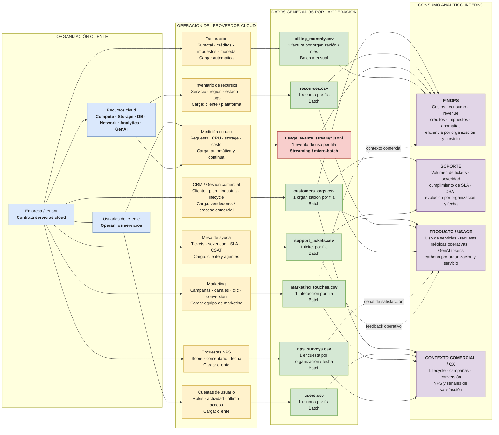
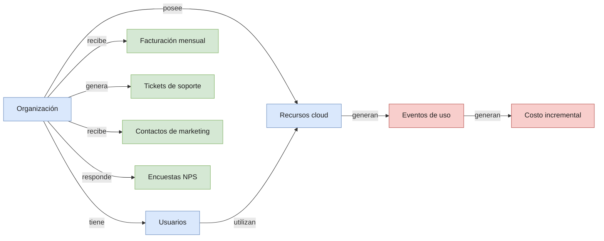

# Diagrama de Negocio — Cloud Provider Analytics

> **Propósito**  
> Representar de forma visual cómo funciona el negocio del proveedor cloud, qué procesos generan información y qué áreas internas consumen esos datos.  
> Esta vista se mantiene deliberadamente en nivel **negocio / información**: muestra origen, fuente, frecuencia y uso analítico, pero no incorpora todavía detalles de Landing, Bronze, Silver, Gold, Spark o Cassandra.

---

## 1. Contexto del negocio

La organización analizada es un **proveedor de servicios cloud** que ofrece cómputo, almacenamiento, bases de datos, networking, analytics e IA generativa a organizaciones cliente.

Los datos del proyecto representan la **operación del proveedor sobre sus clientes**: quiénes son, qué recursos tienen, cómo utilizan los servicios, cuánto se les factura, qué reclamos realizan y qué nivel de satisfacción expresan. No representan el contenido que los clientes almacenan dentro de la nube.

Existen dos velocidades principales de información:

- **Streaming / near real-time:** eventos de uso y costo incremental.
- **Batch:** maestros, usuarios, recursos, facturación, soporte, marketing y encuestas.

---

## 2. Vista integral del negocio y sus datos

### Lectura del diagrama

El flujo puede leerse de izquierda a derecha:

1. La **organización cliente** contrata servicios, administra usuarios y opera recursos cloud.
2. Esa actividad interactúa con distintos **procesos del proveedor**: CRM, cuentas, inventario, medición, facturación, soporte, marketing y encuestas.
3. Cada proceso deja una **fuente de datos identificable**, con un grano y una velocidad de generación determinados.
4. Las fuentes son utilizadas por distintos **dominios analíticos internos**, principalmente FinOps, Soporte y Producto / Usage.
5. Algunas fuentes aportan **contexto transversal**. Por ejemplo, NPS y tickets pueden complementar la lectura de Producto, mientras que marketing aporta contexto comercial, pero no son la fuente principal de las métricas operativas.

---

## 3. Mapa proceso → dato → uso

| Proceso de negocio | Quién / qué lo genera | Fuente resultante | Grano | Velocidad | Uso analítico principal |
|---|---|---|---|---|---|
| Gestión comercial / CRM | Vendedores y proceso comercial | `customers_orgs.csv` | 1 organización | Batch | Contexto maestro para todos los dominios |
| Gestión de cuentas | Cliente | `users.csv` | 1 usuario | Batch | Actividad y composición de usuarios |
| Inventario cloud | Cliente / plataforma | `resources.csv` | 1 recurso | Batch | Producto, capacidad y contexto de costos |
| Medición de uso | Plataforma | `usage_events_stream/*.jsonl` | 1 evento de uso | **Streaming** | Uso, costos incrementales, requests, GenAI y carbono |
| Facturación | Sistema de billing | `billing_monthly.csv` | 1 organización / mes | Batch mensual | Revenue, créditos, impuestos y FX |
| Mesa de ayuda | Cliente y agentes | `support_tickets.csv` | 1 ticket | Batch | Severidad, SLA y CSAT |
| Marketing | Equipo de marketing | `marketing_touches.csv` | 1 interacción | Batch | Campañas, clics y conversiones |
| Encuestas | Cliente | `nps_surveys.csv` | 1 organización / fecha | Batch | NPS y experiencia del cliente |

---

## 4. Dominios de negocio y preguntas que deben responder

### FinOps

**Objetivo:** entender el comportamiento económico y de consumo de cada organización.

Fuentes principales: `customers_orgs`, `resources`, `usage_events_stream` y `billing_monthly`.

Preguntas de referencia:

- ¿Cuánto cuesta y cuánto consume cada organización por servicio y por día?
- ¿Qué servicios concentran el mayor costo acumulado?
- ¿Existen incrementos de costo anómalos o fuera del comportamiento esperado?
- ¿Cuál es el revenue mensual considerando créditos, impuestos y conversión de moneda?
- ¿Cómo se distribuyen consumo y costos entre clientes, regiones y servicios?

### Soporte

**Objetivo:** medir la operación de atención al cliente y la calidad del servicio prestado.

Fuentes principales: `customers_orgs` y `support_tickets`.

Preguntas de referencia:

- ¿Cuántos tickets se generan por organización, fecha, categoría y severidad?
- ¿Cómo evolucionan los tickets críticos?
- ¿Qué proporción incumple SLA?
- ¿Cuál es el nivel de satisfacción CSAT en los tickets resueltos?
- ¿Qué clientes presentan mayor presión de soporte?

### Producto / Usage

**Objetivo:** entender cómo se utilizan los servicios y detectar patrones operativos relevantes.

Fuentes principales: `customers_orgs`, `resources` y `usage_events_stream`.

Preguntas de referencia:

- ¿Qué servicios utiliza cada organización y con qué intensidad?
- ¿Cómo evolucionan requests, CPU y almacenamiento?
- ¿Cuántos tokens GenAI se consumen por día cuando la información está disponible?
- ¿Cuál es el costo asociado al uso de GenAI?
- ¿Qué nivel de emisiones de carbono se observa en los eventos que lo informan?

### Contexto comercial y experiencia del cliente

**Objetivo:** complementar la lectura operacional con información de relación, adquisición y satisfacción.

Fuentes principales: `customers_orgs`, `users`, `marketing_touches` y `nps_surveys`.

Preguntas de referencia:

- ¿En qué etapa del ciclo de vida se encuentra cada organización?
- ¿Qué canales y campañas generan interacciones y conversiones?
- ¿Cómo evoluciona el NPS de las organizaciones?
- ¿Existen señales de satisfacción o riesgo que puedan contextualizar el uso, la facturación o el soporte?

> Este bloque se considera **contextual** en la primera versión del proyecto. Los tres dominios analíticos requeridos como foco principal son FinOps, Soporte y Producto / Usage.

---

## 5. Relaciones de negocio clave

Esta vista resume las relaciones semánticas sin reemplazar al DER. El **DER documenta claves y cardinalidades**; este diagrama explica qué significa cada vínculo desde el punto de vista del negocio.

---

## 6. Alcance y límites de esta vista

| Incluido | No incluido en este diagrama |
|---|---|
| Procesos que generan los datos | Implementación Spark |
| Quién carga o produce cada información | Landing / Bronze / Silver / Gold |
| Nombre y grano de las fuentes | Reglas detalladas de calidad |
| Diferencia entre batch y streaming | Quarantine |
| Áreas internas consumidoras | Particionado Parquet |
| Preguntas analíticas principales | Modelo físico de Cassandra / AstraDB |
| Relaciones semánticas de negocio | Claves PK/FK detalladas del DER |

La separación permite que cada artefacto tenga una responsabilidad clara:

- **Diagrama de negocio:** explica el caso y el flujo de información.
- **Diccionario de datos:** documenta campos, grano, tipos, calidad y problemas detectados.
- **DER:** documenta entidades, claves y relaciones.
- **Arquitectura:** explica cómo los datos pasan por ingesta, Data Lake, procesamiento y serving.

---

## 7. Leyenda visual

| Color | Significado |
|---|---|
| Azul | Organización cliente y elementos propios del cliente |
| Amarillo | Procesos operativos del proveedor cloud |
| Verde | Fuentes batch |
| Rojo / salmón | Fuente streaming / near real-time |
| Violeta | Áreas o dominios de consumo analítico |
| Línea continua | Flujo principal de información |
| Línea punteada | Información contextual / complementaria |

---

## 8. Síntesis

El negocio puede resumirse como una cadena simple:

**Organización cliente → operación de servicios cloud → generación de datos → análisis interno para FinOps, Soporte y Producto.**

La principal diferencia de velocidad está en `usage_events_stream`, que representa eventos continuos de utilización y costo. El resto de las fuentes aporta información maestra, financiera, comercial, de soporte o de experiencia que se procesa principalmente por batch.

Esta vista busca conservar suficiente información para justificar el caso de negocio y el flujo de datos de la primera entrega, sin trasladar al diagrama de negocio decisiones técnicas que pertenecen a la arquitectura de implementación.
